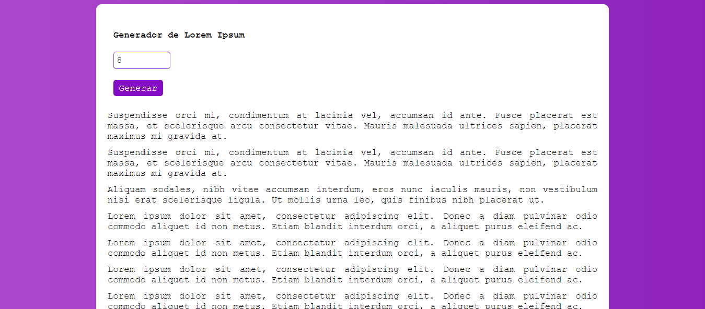

# Generador de Párrafos Aleatorios

Una aplicación web para generar párrafos aleatorios de Lorem Ipsum. Es útil para diseñadores, desarrolladores y cualquier persona que necesite texto de relleno para maquetas y proyectos.


## Características

- **Generación de Párrafos:** Genera una cantidad específica de párrafos de Lorem Ipsum.
- **Interfaz Intuitiva:** Interfaz sencilla y fácil de usar.
- **Texto de Relleno:** Ideal para usar como texto de relleno en proyectos de diseño y desarrollo.

## Instalación y Uso

1. **Clonar el repositorio:**
   ```bash
   git clone https://github.com/Nathaly-Daza/GnTextoLorem.git
   ```

2. **Navegar al directorio del proyecto:**
   ```bash
   cd GnTextoLorem
   ```

3. **Abrir el archivo `index.html` en tu navegador:**
   ```bash
   open index.html
   ```
   O simplemente arrastra el archivo `index.html` a una ventana de tu navegador.

## Archivos del Proyecto

- `index.html`: El archivo HTML principal que estructura la aplicación.
- `style.css`: Archivo CSS que contiene los estilos de la aplicación.
- `script.js`: Archivo JavaScript que maneja la lógica de la aplicación.
- `img/screenshot_main.png`: Captura de pantalla de la aplicación (debes añadir esta imagen).

## Capturas de Pantalla

### Vista Principal


### Resultado de la Generación



## Personalización

Puedes personalizar la aplicación modificando los archivos `style.css` y `script.js` según tus necesidades. Por ejemplo, puedes cambiar los colores, fuentes o diseños utilizados.

## Contribuciones

Las contribuciones son bienvenidas. Por favor, abre un issue para discutir cualquier cambio que te gustaría realizar.

## Visualización

